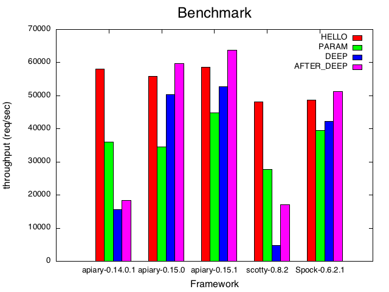

benchmark
===

libraries
---
* apiary
* scotty
* Spock

how to run
---
```.sh
cabal update
cabal sandbox init
cabal install --only-dependencies
cabal configure
cabal build
./bench apiary HELLO > result.log
```

benchmarks
---
1. HELLO (no capture)
2. PARAM (capture route parameter)
3. DEEP  (deep and many routes)
3. AFTER_DEEP (after DEEP route)


machines
---

### machine1

```.sh
% uname -a
Linux machine1 3.2.0-4-amd64 #1 SMP Debian 3.2.57-3+deb7u2 x86_64 GNU/Linux
% cat /proc/cpuinfo | grep 'model name'
model name	: Intel(R) Core(TM) i3-2120T CPU @ 2.60GHz
model name	: Intel(R) Core(TM) i3-2120T CPU @ 2.60GHz
model name	: Intel(R) Core(TM) i3-2120T CPU @ 2.60GHz
model name	: Intel(R) Core(TM) i3-2120T CPU @ 2.60GHz
% cat /proc/meminfo | grep MemTotal
MemTotal:       16354960 kB
```

results
---

### single thread


|machine|  ghc  |  framework      |  HELLO |  PARAM |  DEEP  |AFTER_DEEP|
|-------|-------|-----------------|--------|--------|--------|----------|
|      1|7.8.2  |apiary-0.14.0.1  |37968.63|23406.25| 8626.52|  10200.54|
|      1|7.8.2  |apiary-0.15.0    |35452.27|22527.95|33518.76|  37941.88|
|      1|7.8.2  |apiary-0.15.1    |37740.72|30093.72|35766.76|  39799.59|
|      1|7.8.2  |scotty-0.8.2     |30382.91|17156.59| 2492.32|   9554.43|
|      1|7.8.2  |Spock-0.6.2.1    |31276.21|25046.59|27670.51|  32758.16|

### multi thread(n=2)



|machine|  ghc  |  framework      |  HELLO |  PARAM |  DEEP  |AFTER_DEEP|
|-------|-------|-----------------|--------|--------|--------|----------|
|      1|7.8.2  |apiary-0.14.0.1  |58027.33|36050.53|15519.27|  18282.00|
|      1|7.8.2  |apiary-0.15.0    |55877.49|34609.63|50275.40|  59741.71|
|      1|7.8.2  |apiary-0.15.1    |58512.81|44782.41|52743.26|  63743.26|
|      1|7.8.2  |scotty-0.8.2     |48070.59|27792.28| 4737.47|  17084.61|
|      1|7.8.2  |Spock-0.6.2.1    |48685.34|39516.63|42240.88|  51292.46|

references
---
1. [agrafix/Spock-scotty-benchmark](https://github.com/agrafix/Spock-scotty-benchmark)
